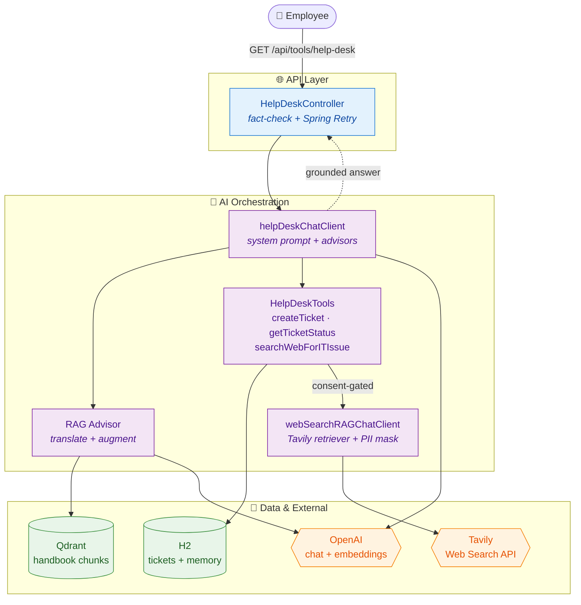

# CareDesk

An AI-powered employee help-desk assistant built with **Spring Boot** and **Spring AI**. CareDesk answers HR and IT questions grounded in company documentation using Retrieval-Augmented Generation (RAG), creates and tracks support tickets through autonomous tool-calling, falls back to live web search when needed, and fact-checks its own answers before returning them.

## Features

- **RAG over the company handbook** — Ingests an HR/employee handbook PDF (Apache Tika), splits it into token-based chunks, and stores embeddings in a **Qdrant** vector store. Answers are grounded in retrieved context (top-K with a similarity threshold) rather than the model's general knowledge.
- **Agentic tool-calling** — The LLM autonomously decides when to create a support ticket, check ticket status for a user, or trigger a web search, backed by JPA persistence.
- **Web-search fallback** — A custom `DocumentRetriever` integrates the **Tavily** search API for IT/software troubleshooting. It is consent-gated: used only after the handbook has no answer and the user agrees to a web search.
- **Self fact-checking** — Responses are validated by an LLM-based `FactCheckingEvaluator`. Unsupported answers trigger **Spring Retry** (retry-and-recover). Side-effecting tool responses (ticket create/status) are skipped to avoid re-execution.
- **Conversational memory** — Per-user, multi-turn context via JDBC-backed message-window chat memory.
- **PII masking (data minimization)** — A document post-processor redacts emails and phone numbers from untrusted **web-search results** before they are sent to the LLM provider. The internal handbook is intentionally exempt, since its contact details are content employees are meant to receive.
- **Multilingual queries** — A translation query transformer normalizes incoming queries to English before retrieval.
- **Observability** — Token-usage audit advisor for cost tracking, plus Actuator, Micrometer/Prometheus metrics, Grafana dashboards, and OpenTelemetry tracing exported to Jaeger.

## Tech Stack

| Area | Technology |
|------|-----------|
| Language / Framework | Java 25, Spring Boot 4, Spring AI |
| LLM | OpenAI (chat + embeddings) |
| Vector store | Qdrant |
| Document ingestion | Apache Tika |
| Persistence | Spring Data JPA, H2 |
| Web search | Tavily API |
| Build | Maven |
| Observability | Spring Actuator, Micrometer, Prometheus, Grafana, OpenTelemetry, Jaeger |
| Infra | Docker Compose |

## Architecture



The application exposes three configured `ChatClient` beans:

- **`helpDeskChatClient`** — primary client with the help-desk system prompt, tools, and handbook RAG.
- **`chatMemoryChatClient`** — RAG client with conversational memory and query translation.
- **`webSearchRAGChatClient`** — backs the web-search tool via the Tavily retriever.

## API

`GET /api/tools/help-desk`

| Parameter | Location | Description |
|-----------|----------|-------------|
| `username` | Header | Identifies the user (used for tickets and conversation memory) |
| `message` | Query param | The user's question or request |

Example:

```bash
curl -H "username: jdoe" \
  "http://localhost:8080/api/tools/help-desk?message=How%20many%20vacation%20days%20do%20I%20get%3F"
```

## Getting Started

### Prerequisites

- Docker Desktop
- An OpenAI API key and a Tavily API key

### Environment variables

```bash
export OPENAI_API_KEY=your_openai_key
export TAVILY_SEARCH_API_KEY=your_tavily_key
export DB_USERNAME=your_db_username
export DB_PASSWORD=your_db_password
```

### Run

Start the supporting services (Qdrant, Prometheus, Grafana, Jaeger):

```bash
docker compose up -d
```

> Spring Boot Docker Compose support will also start these automatically on application boot.

Then run the application:

```bash
./mvnw spring-boot:run
```

The app starts on `http://localhost:8080`. On startup it loads the handbook PDF into Qdrant (`HRPolicyLoader`).

### Useful endpoints

| URL | Description |
|-----|-------------|
| `http://localhost:8080/h2-console` | H2 database console |
| `http://localhost:8080/actuator/prometheus` | Prometheus metrics |
| `http://localhost:6333/dashboard` | Qdrant dashboard |
| `http://localhost:9090` | Prometheus |
| `http://localhost:3000` | Grafana |
| `http://localhost:16686` | Jaeger tracing UI |

## Project Structure

```
src/main/java/com/project/caredesk/
├── advisors/        TokenUsageAuditAdvisor          (cost logging)
├── configuration/   ChatClient bean definitions     (RAG, memory, web search)
├── controller/      HelpDeskController              (API + fact-check/retry)
├── entity/          HelpDeskTicket                  (JPA entity)
├── model/           TicketRequest                   (DTO)
├── rag/             HRPolicyLoader, WebSearchDocumentRetriever,
│                    PIIMaskingDocumentPostProcessor
├── repository/      HelpDeskTicketRepository
├── service/         HelpDeskTicketService
└── tools/           HelpDeskTools                   (LLM-callable tools)

src/main/resources/
├── promptTemplates/ system + fact-check prompts (.st)
├── schema/          chat-memory schema
└── NexGen_Employee_Handbook_2025.pdf
```
